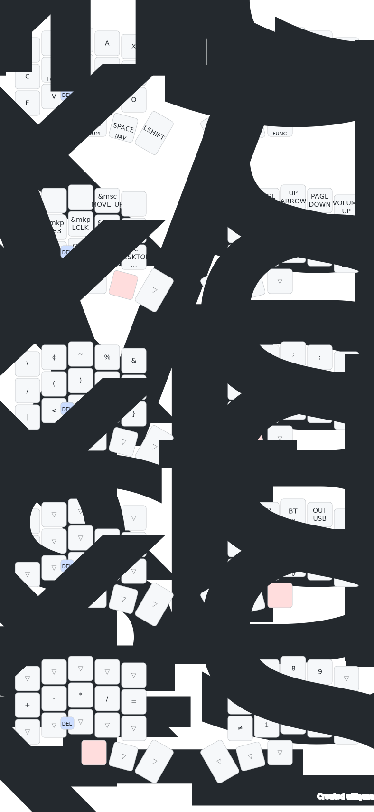

## Local Build ZMK Firmware

## Keymap
Here is my default keymap for a 3x5 + 3 keyboard: 

Since I write in German, I need to include some special characters like ä, ö, ü, and ß. The layout is a slight adaptation (due to missing keys) of the [Bone Neo](https://www.neo-layout.org/Layouts/bone/).
